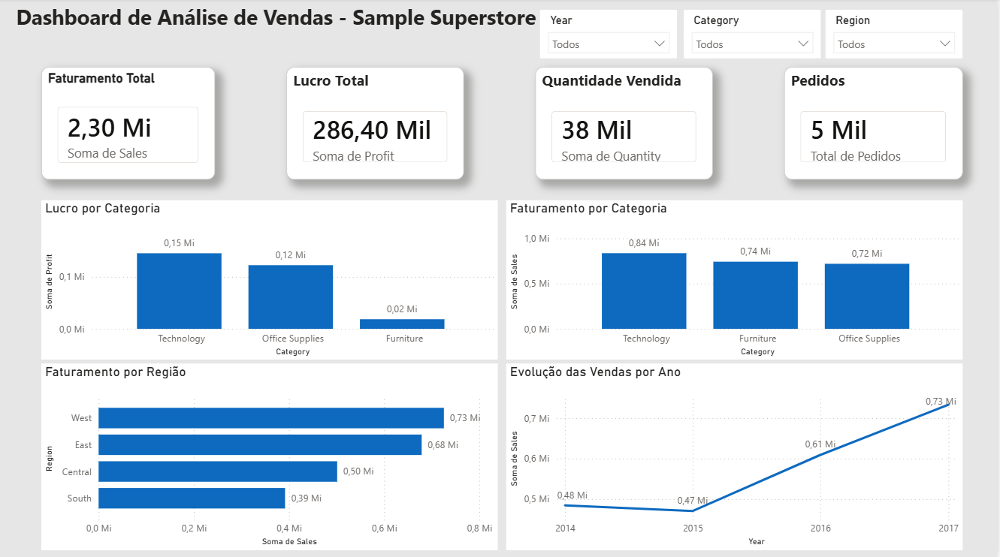

# Análise de Vendas — Superstore

## Sobre o projeto

Este projeto tem como objetivo analisar os dados de vendas da Superstore, buscando identificar padrões de vendas, categorias com melhor desempenho, regiões com maior faturamento e evolução das vendas ao longo do tempo.

A análise foi desenvolvida utilizando Python, pasndas, Matplotlib e Power BI, com foco na exploração dos dados e na criação de indicadores para apoiar a interpretação dos resultados.

## Ferramentas utilizadas

- Python
- Pandas
- Matplotlib
- Power BI
- Jupyter Notebook

## Dataset

O projeto utiliza o dataset Sample - Superstore, contendo informações relacionadas a pedidos, produtos, categorias, regiões, vendas e lucros.
Os dados foram utilizados para realizar análises exploratórias e construir visualizações que permitissem identificar os principais resultados do negócio.

## Análises realizadas

Durante o projeto, foram realizadas análises como:
- Faturamento por categoria;
- Lucro por categoria;
- Quantidade de produtos vendidos;
- Faturamento por região;
- Evolução das vendas ao longo dos anos;
- Identificação das categorias com maior faturamento.

## Principais resultados

A categoria Tecnologia apresentou o maior faturamento entre as categorias analisadas, seguida por Móveis e Material de Escritório.

Os resultados também foram utilizados na construção de um dashboard no Power BI, permitindo uma visualização mais clara dos principais indicadores de vendas e desempenho.

## Dashboard

Abaixo está o dashboard desenvolvido no Power BI:

